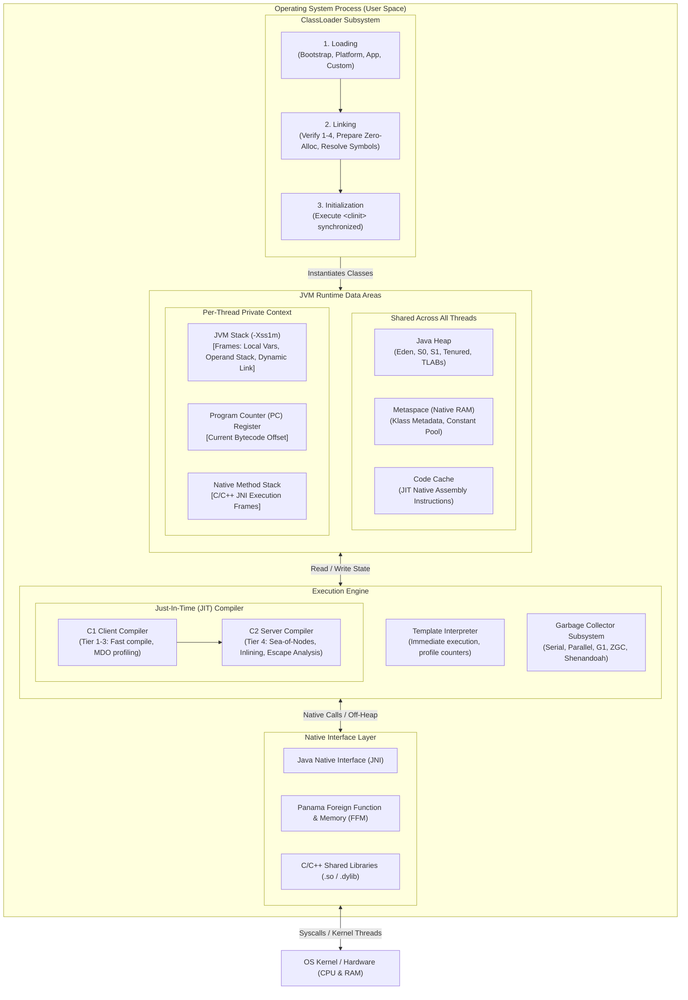

# Architectural Diagram: Master JVM Architecture Map

```mermaid
flowchart TB
    subgraph OS_PROCESS["Operating System Process (User Space)"]
        
        subgraph CLASSLOADER["ClassLoader Subsystem"]
            direction TB
            CL_LOAD["1. Loading<br/>(Bootstrap, Platform, App, Custom)"]
            CL_LINK["2. Linking<br/>(Verify 1-4, Prepare Zero-Alloc, Resolve Symbols)"]
            CL_INIT["3. Initialization<br/>(Execute &lt;clinit&gt; synchronized)"]
            CL_LOAD --> CL_LINK --> CL_INIT
        end

        subgraph MEMORY["JVM Runtime Data Areas"]
            direction TB
            subgraph SHARED["Shared Across All Threads"]
                HEAP["Java Heap<br/>(Eden, S0, S1, Tenured, TLABs)"]
                META["Metaspace (Native RAM)<br/>(Klass Metadata, Constant Pool)"]
                CODE["Code Cache<br/>(JIT Native Assembly Instructions)"]
            end
            
            subgraph PER_THREAD["Per-Thread Private Context"]
                STACK["JVM Stack (-Xss1m)<br/>[Frames: Local Vars, Operand Stack, Dynamic Link]"]
                PC["Program Counter (PC) Register<br/>[Current Bytecode Offset]"]
                NMS["Native Method Stack<br/>[C/C++ JNI Execution Frames]"]
            end
        end

        subgraph ENGINE["Execution Engine"]
            direction TB
            INTERP["Template Interpreter<br/>(Immediate execution, profile counters)"]
            
            subgraph JIT["Just-In-Time (JIT) Compiler"]
                C1["C1 Client Compiler<br/>(Tier 1-3: Fast compile, MDO profiling)"]
                C2["C2 Server Compiler<br/>(Tier 4: Sea-of-Nodes, Inlining, Escape Analysis)"]
                C1 --> C2
            end
            
            GC["Garbage Collector Subsystem<br/>(Serial, Parallel, G1, ZGC, Shenandoah)"]
        end

        subgraph NATIVE_INTERFACE["Native Interface Layer"]
            JNI["Java Native Interface (JNI)"]
            FFM["Panama Foreign Function & Memory (FFM)"]
            LIBS["C/C++ Shared Libraries (.so / .dylib)"]
        end

    end

    CLASSLOADER -->|Instantiates Classes| MEMORY
    MEMORY <-->|Read / Write State| ENGINE
    ENGINE <-->|Native Calls / Off-Heap| NATIVE_INTERFACE
    NATIVE_INTERFACE <-->|Syscalls / Kernel Threads| KERNEL["OS Kernel / Hardware (CPU & RAM)"]
```
